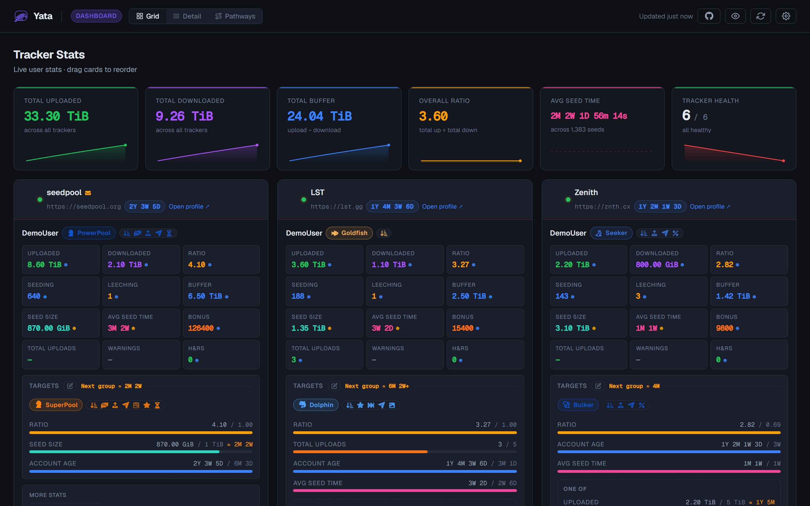
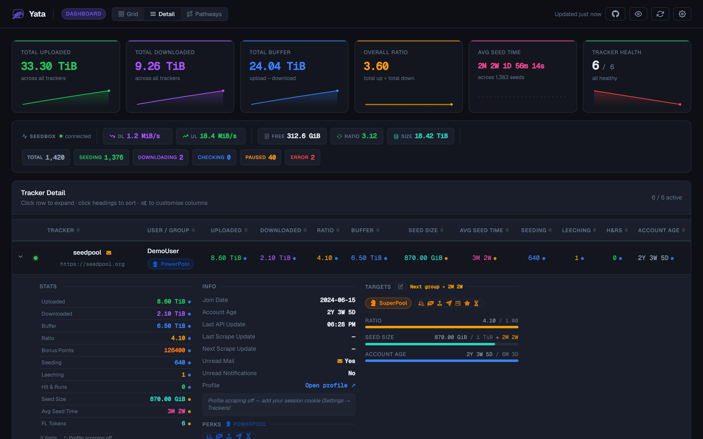
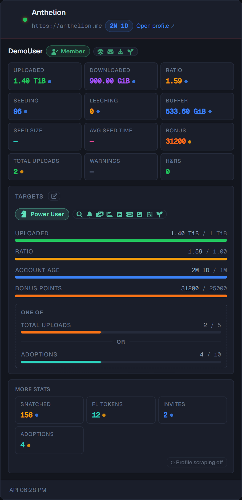
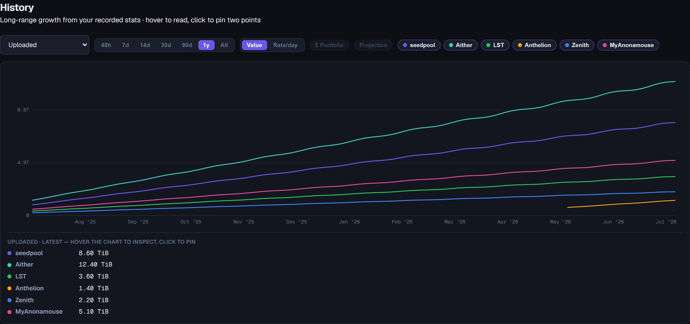
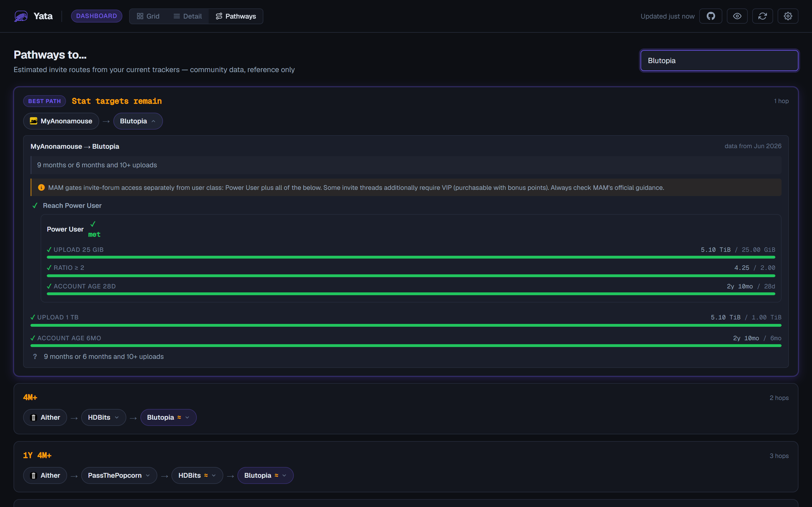
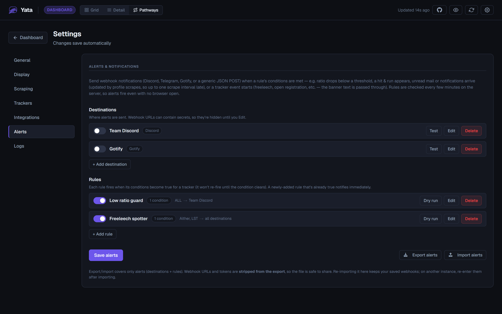
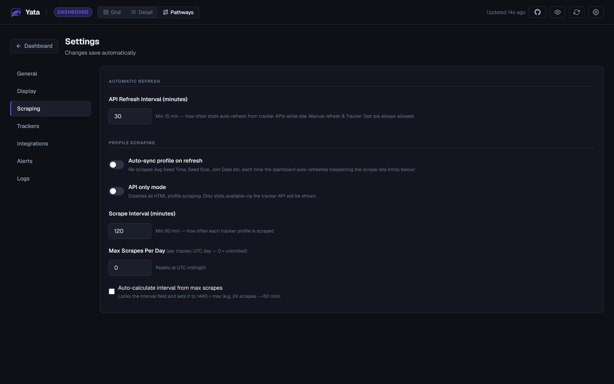
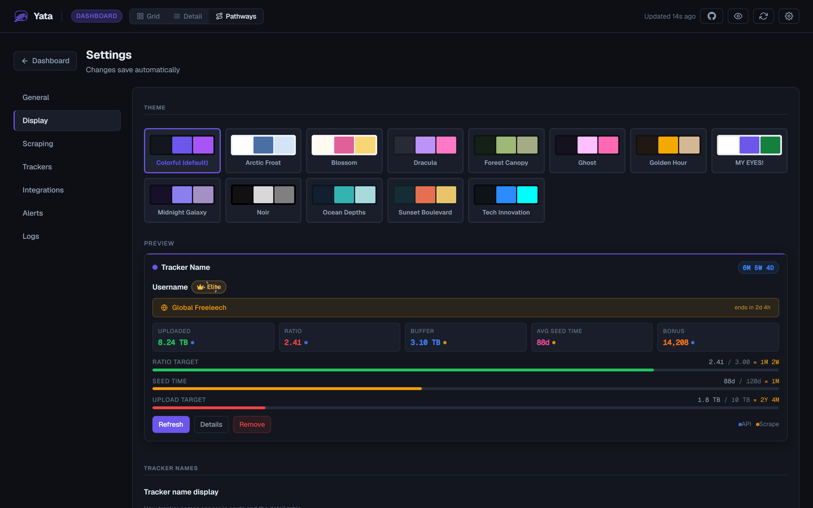
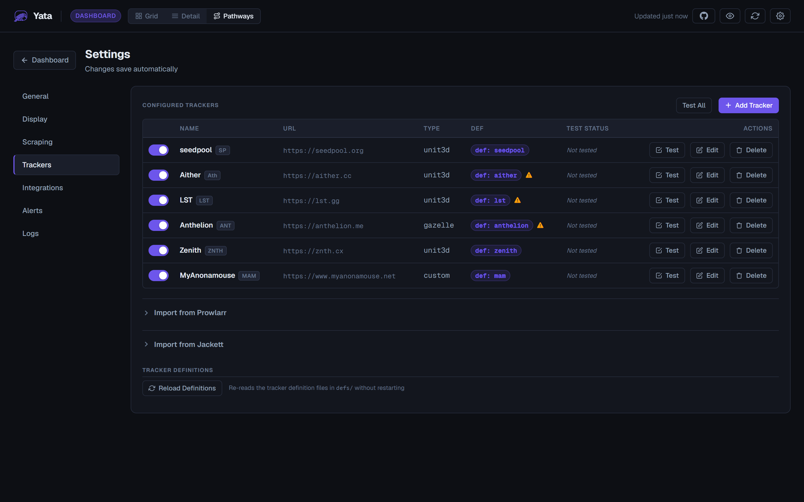

# Yata

> Self-hosted dashboard for monitoring your stats across all your private trackers — one page, one binary, your data stays yours.



Yata pulls your stats from each tracker's **API** (and, where the operator permits it, politely fills the gaps from your profile page), stores everything in a local SQLite database, and shows it all on one dashboard: unified stats, group/rank progress, promotion targets, trends, alerts, and estimated invite routes to trackers you don't have yet.

**Status: public beta.** It works, it's been running against real trackers for months, and feedback is very welcome — see [Feedback & beta notes](#feedback--beta-notes).

> **⚠️ Protect your `config.json`.** Yata stores your tracker **API keys and session cookies in plain text** in `config.json` (next to the binary, or in `./data` under Docker). Anyone who can read that file can act as you on your trackers. Lock it down like a password file — restrict its permissions and never share or commit it — and take extra care on **shared boxes such as seedboxes**. See [Your data and security](#your-data-and-security) before you start.

---

## Why Yata

- **Private by design.** Runs entirely on your own machine/server. The only network requests it ever makes are to *your* trackers with *your* credentials, plus any integrations you explicitly configure (webhooks, qui, Prowlarr). No telemetry, no analytics, no phoning home.
- **API first, always.** API data is authoritative. Profile scraping only fills stats the API doesn't provide, and both are merged into ONE stats view per tracker (with an optional per-stat origin dot so you can see where each number came from).
- **Respect the trackers.** Scraping is rate-limited with a hard 60-minute floor that cannot be lowered. Tracker operators can request stricter limits — or forbid scraping entirely — in their definition file, and those requests always win. There's an API-only mode, and an opt-out list for sites that don't want to be supported at all.
- **Trackers are data, not code.** Every tracker is a JSON file in `defs/trackers/`. Adding or fixing a tracker never touches the app; tracker staff can own their definition.

## Feature tour

### One dashboard, every tracker

Grid or table, your choice. Cards show unified stats, styled group badges with the tracker's own rank icons, perk lists, active event banners (freeleech etc.), account age, and live progress toward your targets. Hover a stat for its recent per-day trend ("≈ 245.3 GiB per day"); the dot next to each value shows whether it came from the API or a profile scrape.



### Targets & promotions

Load targets straight from a rank's real requirements ("Load from Group"), or set your own. Progress bars, time estimates from your recent growth, and full support for either/or requirements — e.g. Anthelion's *"5 uploads and/or 10 adoptions"*:

<p align="center"></p>

Requirements and estimates are guidance for planning, not guarantees — always check the tracker's own promotion rules.

### History — see your growth

A dedicated view over the months of stats Yata records for every tracker. Pick a metric, overlay one or many trackers in their own colours, and choose a range from 48 hours to all-time. Hover for a crosshair readout, or click to pin two points for an exact delta and per-day rate. Switch between cumulative **Value** and **Rate/day**, add a **Σ Portfolio** line summing your trackers, or turn on a dashed **projection** tail. With a single tracker selected, its targets (yours or its group's) are drawn as reference lines — so you can watch your trajectory close on the goal:



### Pathways — where can I go from here?

Estimated invite routes from the trackers you have to the one you want, powered by the community [trackerpathways](https://github.com/handokota/trackerpathways) dataset (MIT). The first hop is evaluated against your live stats — including the full class-requirement breakdown — and later hops use community estimates. Tracker-specific invite rules that the community data misses (e.g. MyAnonamouse's separate invite-forum requirements) are layered in from the tracker's definition, clearly marked:



### Alerts & notifications

Webhook notifications to Discord, Telegram, Gotify, or any generic JSON endpoint. Build rules from conditions (ratio below X, hit & run appears, tracker unreachable, a freeleech/event banner goes up — the banner text is passed through), scope them to specific trackers, and set cooldowns. Rules are evaluated on the server every few minutes, so alerts fire even with no browser open. Webhook URLs are hidden in the UI once saved, and the alerts export strips secrets so you can share your setup safely.



### Polite scraping, transparent policy

The dashboard shows exactly why any scrape is blocked and when the next one is allowed. Limits are enforced server-side and survive restarts.



The effective interval is the **maximum** of every layer — nothing can undercut a stricter layer above it:

| Layer | Set by | Notes |
|---|---|---|
| Hard floor | the app | 60 min — cannot be lowered by anyone |
| Global setting | you (Settings → Scraping) | default 120 min (floor 60) |
| Tracker type def | software def file | rarely used |
| Tracker def | **tracker operator** | e.g. "≥ 120 min, max 6/day" |
| Per-tracker setting | you (tracker edit) | can only make it stricter |

The daily cap takes the most restrictive non-zero value, and an operator's `disable_scraping` can never be overridden. Trackers on the opt-out list (`defs/optout.json`) cannot be added at all.

### Themes & display

Thirteen built-in themes plus a live preview of every display option. Drop your own `.css` in `static/themes/` to add more — override only the variables you want.



Tracker rank icons use the same Font Awesome classes the tracker sites themselves use. If you own Font Awesome Pro, drop it into `static/fontawesome/` (`css/all.min.css` + `webfonts/`) and you'll see the real icons; without it, Pro-only icons automatically fall back to a free icon — nothing breaks.

### And the rest

- **Connectivity test** per tracker — one click tells you whether the API, the scrape cookie, or both are working, and why not
- **48-hour sparklines** and aggregate trend cards
- **Login protection** — optional single-user auth (bcrypt + sessions) for instances reachable beyond localhost, with optional TOTP two-factor, single-use recovery codes and brute-force lockout
- **Backups & portability** — one-click config export/import (with automatic pre-import backup), opt-in scheduled backups, tracker history CSV export
- **Rolling log viewer** — live logs in Settings for troubleshooting and bug reports; query strings never reach the log
- **qui integration** — live qBittorrent stat bars via [qui](https://github.com/autobrr/qui)
- **Read-only API tokens** — let homelab dashboards (Homepage, Homarr), Grafana, or scripts read your stats without your login; tokens can't change anything or see credentials. See the [API reference](docs/API.md)
- **Prowlarr / Jackett import** — pull your indexer list straight from either manager, including stored API keys (both) and session cookies (Jackett), so trackers arrive ready to fetch and scrape
- **Demo tracker** — explore the whole UI safely with mock data, no credentials needed



## Quick start

### Docker (recommended)

Drop this `docker-compose.yml` next to wherever you want Yata's data to live, then `docker compose up -d`:

```yaml
services:
  yata:
    image: ghcr.io/yata-dash/yata-dash:main
    container_name: yata
    ports:
      - "8420:8420"          # then open http://<host>:8420
    volumes:
      - ./data:/data         # config.json + database — back up this folder
    environment:
      - TZ=Etc/UTC           # optional: your timezone, e.g. Australia/Brisbane
    restart: unless-stopped
```

```bash
docker compose up -d
# → http://localhost:8420
```

Only `./data` has to persist (your config + database); mount `./defs` and `./static/themes` too if you want to edit tracker definitions or drop in custom themes live. Update with `docker compose pull && docker compose up -d`.

> **New to Docker?** You don't need Go, Node, or a repo checkout — Docker pulls a ready-to-run image. `docker compose up -d` starts it in the background; `docker compose logs -f` shows what it's doing; `docker compose down` stops it (your `./data` stays). That's the whole loop.

*Prefer to build the image yourself?* Clone the repo and use the bundled compose with `build: .` instead of the published image — `git clone https://github.com/Yata-Dash/Yata-Dash && cd Yata-Dash && docker compose up -d`.

### From source

Prerequisites: [Go 1.23+](https://go.dev/dl/) and [Node.js 18+](https://nodejs.org/).

```powershell
# Windows
.\build.ps1 -Run
```

```bash
# Linux / macOS
make build && ./yata
```

### Port / address / paths

```
yata --port 9000 --host 127.0.0.1     # flags win
YATA_PORT=9000 yata                # then environment
config.json → { "server": { ... } }      # then config
```

Also: `--config`, `--data` (SQLite file), `--defs`, `--base`, `--log` — each with a `YATA_*` env equivalent.

## Setting up

### Your data and security

**Read this first.** Yata keeps everything in two files, next to the binary (or in `./data` under Docker):

- **`config.json`** — your trackers, settings, and **credentials**. Your tracker **API keys and session cookies are stored in plain text** in this file. Anyone who can read it can act as you on every tracker you've added.
- **`yata.db`** — stats, history, and login sessions.

**Treat `config.json` like a password file:**

- Yata sets the permissions itself: `config.json`, its backups, `yata.db` (and its `-wal`/`-shm` sidecars) and `yata.log` are created owner-only (`0600`), the backup directory `0700`, and anything left world-readable by an older version is tightened at startup. Verify with `ls -l` if you like — and if you see a startup warning that permissions could not be set, your filesystem doesn't support them and the directory itself needs locking down.
- Never commit it to git, paste it into a bug report, or share it. **The config export is not a sanitised copy** — `Settings → General → Export config` sends you `config.json` byte for byte, API keys and session cookies included. It is a backup, and nobody legitimate will ever ask you for it. Exporting asks for your password (and your authenticator code if 2FA is on), so a borrowed session can't take it. The one export that *is* stripped is **Export alerts** (`yata-alerts.json`), which blanks webhook URLs, tokens and chat IDs, and is the one safe to share. To get help with a problem, send a **log** — those have credentials stripped out.
- Be especially careful on **shared or multi-user boxes such as seedboxes**: anyone who can read your home directory can read your tracker credentials. If you can't lock the file down there, prefer **API-only** setups (an API key alone, no session cookie) and rotate/revoke keys you no longer use.

Both files are yours to back up and move (export/import from Settings → General) — just treat every backup as the bundle of credentials it is.

**The log is safe to share.** `yata.log` is meant to be attached to a GitHub issue, so credentials are stripped on the way in: URL query strings, the userinfo part of a URL, and API responses are all redacted before anything is written, whichever code path did the logging. A failed API response records the *shape* of what came back — the field names and their types — never the values, because a tracker's user endpoint carries your email and IRC key. Skim it before posting all the same.

### Add your trackers

1. Open **Settings → Trackers → Add Tracker** and pick your tracker from the list (or enter any base URL — trackers without a definition still work for all API stats).
2. Paste your **API key** (usually tracker profile → API/Security settings; the form shows a tracker-specific hint where we have one).
3. *Optional, for extra stats:* add your **username** and **session cookie** to enable profile scraping for the stats the API doesn't expose (seed size, average seed time, and friends). Log in to the tracker → DevTools (F12) → copy the cookie header. Trackers that report no join date will ask you to enter it once, for account-age tracking.
4. Hit **Test** — it tells you immediately whether the API and the scrape each work, and what's missing if not.

### If your instance is reachable from outside localhost

Yata binds to `0.0.0.0` by default (so Docker/LAN/Tailscale setups just work) and will warn you at startup and in the UI: **anyone who can reach the port has full access until you enable login protection** (Settings → General → Account). Passwords are a minimum of 12 characters; sessions are httpOnly cookies; five failed attempts lock the IP for 15 minutes.

If Yata is reachable from outside your network, turn on **two-factor authentication** in the same place. It works with any authenticator app, and enrolment gives you ten single-use recovery codes — save them, as they're shown only once.

**If you're locked out:** use a recovery code. With no second factor and no codes left, stop Yata and run it once with `-reset-auth` on the machine hosting it (`docker exec` works too). That removes the login and nothing else — every tracker, stat and setting is kept. There is deliberately no way to reset the login over the network.

Put it behind a reverse proxy with TLS if you expose it beyond your LAN.

### Reaching Yata by a hostname

**If you browse to an IP address or to `localhost`, skip this — there is nothing to set.**

Yata answers to IP addresses and `localhost` out of the box. Any *other* hostname — a domain, a Tailscale MagicDNS name — has to be named first. That one rule blocks **DNS rebinding**, where a web page you visit re-points its own domain at your machine so its scripts can read Yata as if they were part of it. It works even when Yata is bound to `127.0.0.1`, and no cookie or CORS setting stops it. Rebinding needs a hostname the attacker controls, so Yata simply won't answer to names it wasn't told about.

You need this if you reach Yata at something like `https://yata.example.com` or `http://box.tailnet-name.ts.net:8420`. **You'll know**: the page says so and names the exact setting to add — it never fails silently.

You can list more than one, which is what you want if you use both a domain and a Tailscale name.

**Already able to reach the dashboard? Use Settings → Network.** Add the hostname to *Allowed hostnames* and save — it applies immediately, with no restart. This is the one to use if you set Yata up on `localhost` and want your domain to work before you next travel, because it doesn't need you to be at the machine.

For the other cases — a new install you'll only ever reach by its domain, or a hostname you can't get in to add — set it before Yata starts:

**Docker / docker-compose** — add it to the `environment:` block. This is the one to use for a remote-first install, since it works on the very first start, before a config file exists:

```yaml
environment:
  - TZ=Etc/UTC
  - YATA_ALLOWED_HOSTS=yata.example.com,box.tailnet-name.ts.net
```

**Windows, or running the binary directly** — add `--allowed-hosts=yata.example.com` to the shortcut or batch file that starts it. To put it in `config.json` instead (next to the exe), it goes in the `settings` block, not `server`:

```json
"settings": {
  "allowed_hosts": ["yata.example.com", "box.tailnet-name.ts.net"]
}
```

Restart Yata after editing the file.

**Linux with systemd** — in the unit file:

```ini
Environment=YATA_ALLOWED_HOSTS=yata.example.com
```

These combine rather than override: a name set any of these ways works, so a flag and a name added in Settings are both honoured. The one exception is `*`, which turns the check off entirely — that's accepted only from `--allowed-hosts` or `YATA_ALLOWED_HOSTS`, never from Settings or an imported config, so disabling it takes access to the machine rather than a browser session.

#### Does my reverse proxy need this?

It depends on the proxy, which is worth knowing because two people with "a reverse proxy" can get different answers:

- **Caddy** (`reverse_proxy`) passes your domain through by default → **you need to set it**.
- **nginx** with `proxy_set_header Host $host;` → **you need to set it**. Without that line, nginx sends the upstream address instead and it works untouched.
- **Traefik**, **Nginx Proxy Manager** → pass the domain through → **you need to set it**.

Tailscale is the same story: reaching the machine by its `100.x.y.z` address needs nothing, but MagicDNS names and `tailscale serve` both put a hostname in front and need naming.

## For tracker staff

Yata is built to be a good citizen, and definitions are designed so **you** stay in control:

- Your definition file (`defs/trackers/yours.json`) carries your **rate-limit requests** (`min_interval_minutes`, `max_scrapes_per_day`) and they override every user setting — or set `disable_scraping: true` and Yata will never touch a profile page on your site.
- Prefer not to be supported at all? One entry in `defs/optout.json` blocks your tracker from being added, with a message shown to the user.
- Every definition records `last_updated` and `approved_by` (staff name/role/date) so support stays accountable and current.
- API-first means a user with an API key generates exactly the same load as any API consumer you already allow — scraping only exists to fill the gaps your API leaves, at a floor of once per hour.
- **Yata identifies its traffic** so you can monitor it: by default every request (API and scrape) carries a `Yata/<version>` User-Agent suffix — one `grep Yata access.log` tells you exactly what the app does on your site, and a one-line nginx/WAF rule can rate-limit or block it. Your def's `identify` field can switch this to an `X-Yata-Version` header (if your session security dislikes UA changes) or disable it (if your bot protection would challenge it).

Questions, corrections, or requests — please open an issue.

## Bundled tracker definitions

Any trackers not approved should only be used in API only mode until approval has been confirmed. A warning will appear in app.
If you are a tracker not on this list please reach out.
If you are a tracker on this list and wish to approve or ask to opt out entirely, please reach out. 

<!-- BEGIN GENERATED TRACKER TABLE (go run ./tools/defsdoc) -->
| Tracker | Platform | Approved | Stats | Limit | Notes |
|---|---|---|---|---|---|
| Aither | UNIT3D | Yes | 3/6 (4 scraped) | 180min | Monthly Uploads not currently retrievable |
| AnimeBytes | Custom API | No | 4/4 | API only | Uses the personal stats API; account age is entered manually |
| Anthelion | Gazelle (ANT/NEB) | Yes | 6/6 | API only | Expanded API stats added 2026-07, shared with Nebulance |
| Aura4K | UNIT3D | Yes | 3/6 (4 scraped) | 180min |  |
| Blutopia | UNIT3D | No | 3/5 | API only |  |
| BroadcastTheNet | Custom API | No | 5/6 | API only | JSON-RPC userInfo; 150 API calls per hour |
| DarkPeers | UNIT3D | Yes | 3/6 (4 scraped) | 180min |  |
| GazelleGames | GazelleGames | No | 1/1 | API only |  |
| Hawke-uno | UNIT3D | No | 6/6 | API only | Not on this tracker can't seek approval |
| InfinityHD | UNIT3D | Yes | 3/6 (4 scraped) | Default |  |
| LST | UNIT3D | Yes | 3/6 (4 scraped) | 180min |  |
| Luminarr | UNIT3D | Yes | 3/6 (4 scraped) | 120min |  |
| MidnightScene | UNIT3D | Yes | 3/5 (4 scraped) | 60min |  |
| MyAnonamouse | Custom API | Yes | 3/3 | API only |  |
| Nebulance | Gazelle (ANT/NEB) | No | 5/5 | API only | Ratioless; episode and season seed-time rules differ |
| OldToonsWorld | UNIT3D | Yes | 5/5 | API only | Added all required stats to API - Thanks team! |
| OnlyEncodes+ | UNIT3D | Yes | 3/6 (4 scraped) | Once per day |  |
| Orpheus | Gazelle (ajax.php) | No | 6/6 | API only | Required ratio is calculated dynamically |
| Redacted | Gazelle (ajax.php) | No | 6/6 | API only |  |
| ReelFliX | UNIT3D | No | 5/5 | API only | Rolling monthly uploads not retrievable |
| RetroFlix | Custom API | Yes | 3/3 | API only | Added API stats - Thanks team! |
| RocketHD | UNIT3D | Yes | 3/6 | API only |  |
| Seedpool | UNIT3D | Yes | 2/3 (3 scraped) | 180min |  |
| SpeedApp | Custom API | Yes | 3/3 | API only | Added API stats - Thanks team! |
| Unwalled | UNIT3D | Yes | 3/5 (4 scraped) | 180min |  |
| Upload.cx | UNIT3D | No | 3/6 | API only |  |
| YUSCENE | UNIT3D | Yes | 3/5 (4 scraped) | 180min |  |
| Zenith | UNIT3D | Yes | 6/6 | API only | API reworked: extended stats and events, proposed upstream |
<!-- END GENERATED TRACKER TABLE -->

**Stats** is how much of that tracker's *own* promotion ladder Yata can follow from its API — "3/6" means three of the six stats its ranks are based on are reported, so progress toward the other three can't be shown. "(4 scraped)" is the figure with profile scraping on, where the operator permits it. A low number is the tracker's API being incomplete, not Yata failing; the app names the exact missing stats on each tracker's page.

Everything but Notes is generated from the definitions (`go run ./tools/defsdoc`), so it can't drift from what the app actually does.

  — plus a credential-free demo tracker. Definitions include the full group ladders (colors, icons, promotion requirements incl. either/or paths, perks) where the tracker publishes them.


Adding one is a JSON file away: copy `defs/templates/tracker.template.jsonc` (every field documented) to `defs/trackers/<key>.json`, strip comments, then **Settings → Trackers → Reload Definitions**. Defs that fail to parse are skipped and reported — they never crash the app.

Note: Z trackers, Torrentleech, IPT don't have api's and are generally not happy about scraping, so these have not been added. Unless API's are added or they reach out to provide permission they wont be supported.

## Development

```
cmd/yata/        entry point (flags/env)
internal/
  api/              HTTP handlers (chi), one file per route group
  config/           config.json (atomic writes, mutex-guarded)
  defs/             definition loading, validation, override-chain resolution
  fetch/            API fetchers: unit3d, gazelle variants, custom (data-driven), demo
  scrape/           multi-strategy HTML profile scraper + rate-limit policy
  stats/            unified stats engine: api + scrape layers → merged view
  store/            SQLite: stat layers, history, scrape log, sessions
  notify/           alert rule engine + webhook senders
  pathways/         invite-route engine (community dataset + live stats)
defs/               external tracker definitions (data, not code)
web/                TypeScript frontend (Vite → static/dashboard.js)
static/, templates/ served assets + app shell
```

```bash
go run ./cmd/yata          # backend on :8420
cd web && npm run dev         # Vite dev server on :5173 with API proxy
```

## Feedback & beta notes

This is a beta: expect rough edges, report anything odd. The most useful reports include the **three versions** from Settings → General (app, definitions, pathways — click *Check for updates* to see if any are out of date; a stale defs/pathways version is often the cause), your tracker + whether API/scrape/test work (Settings → Trackers → Test), and a snippet from Settings → Logs.

Especially interested in: trackers whose stats parse wrong, group ladders that drifted from the def, promotion/pathway estimates that disagree with reality, and anything a tracker operator wants changed about how their site is handled.

## License

[GPL-3.0](LICENSE). Free to use, study, modify, and redistribute — forever. Any derivative must stay open source under the same terms, so no fork of Yata can ever become a paid or closed product. If you'd rather rebuild the whole idea from scratch in your own code, that's not a derivative and you owe nobody anything — go for it, we actively encourage it.


## Credits

- [trackerpathways](https://github.com/handokota/trackerpathways) — community invite-route dataset (MIT), bundled as `defs/pathways/routes.json`
- [qui](https://github.com/autobrr/qui) — qBittorrent stats integration
- Font Awesome Free — bundled icon set (Pro supported but never bundled; bring your own license)

*All data in the screenshots above is synthetic demo data.*
