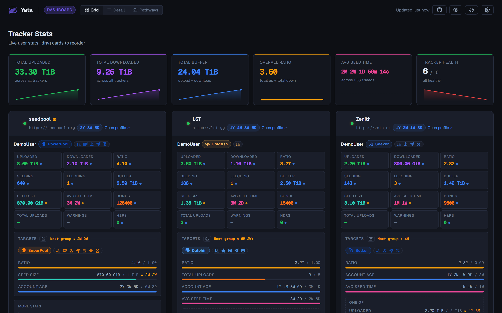
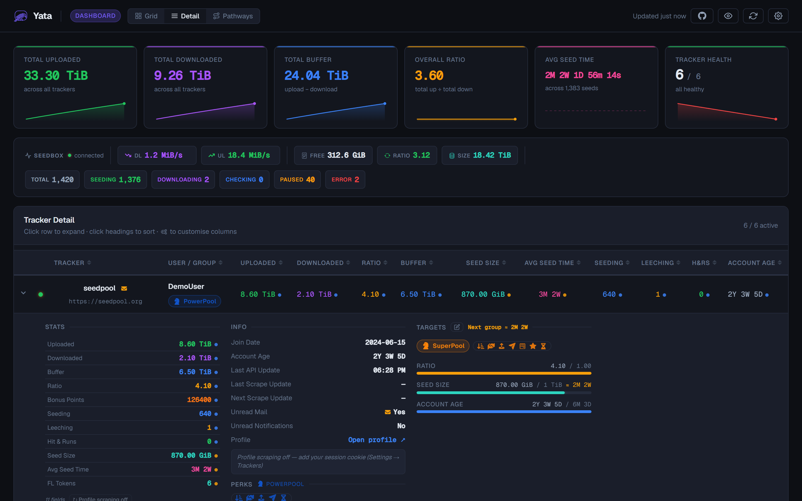
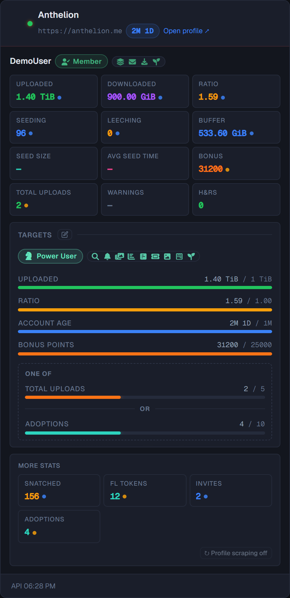
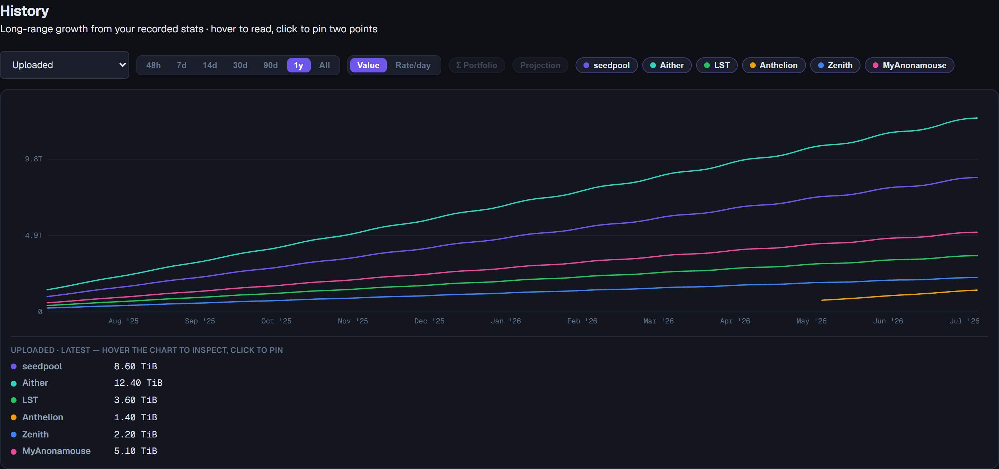
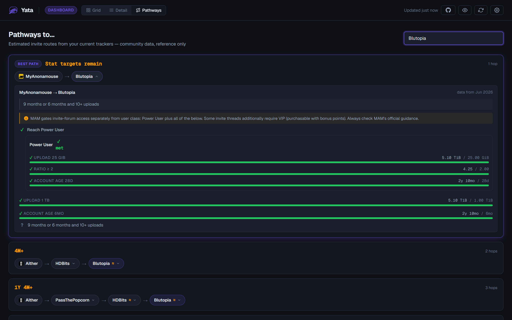
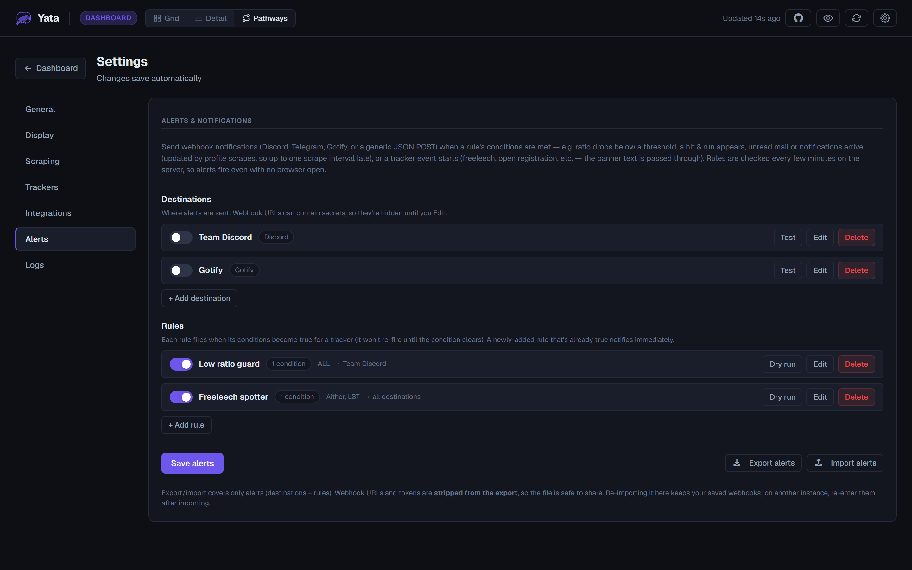
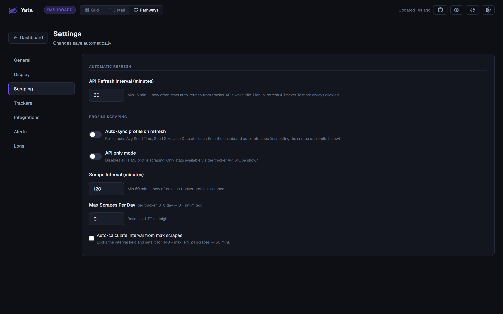
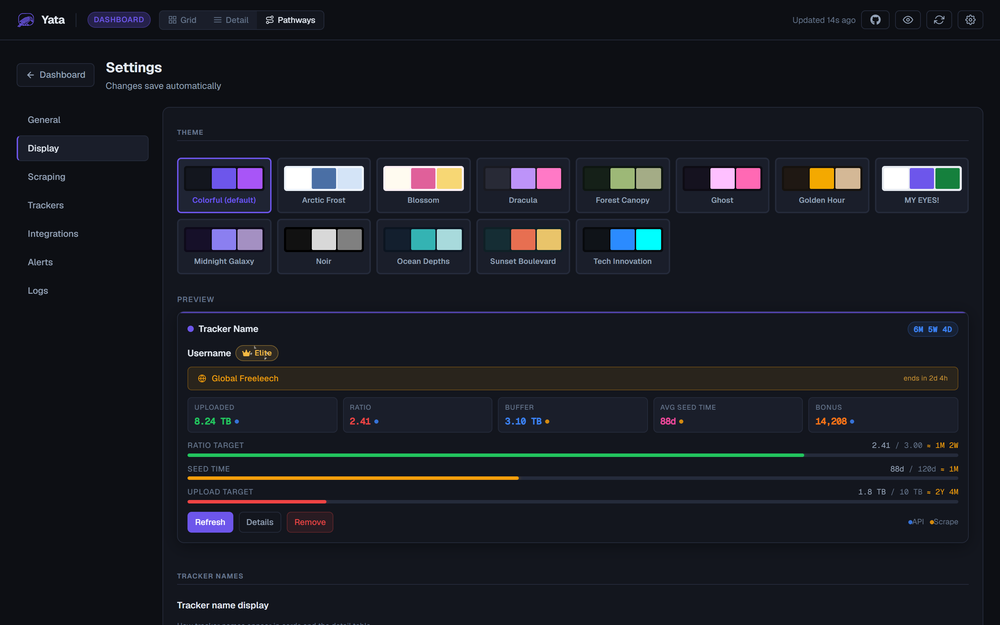
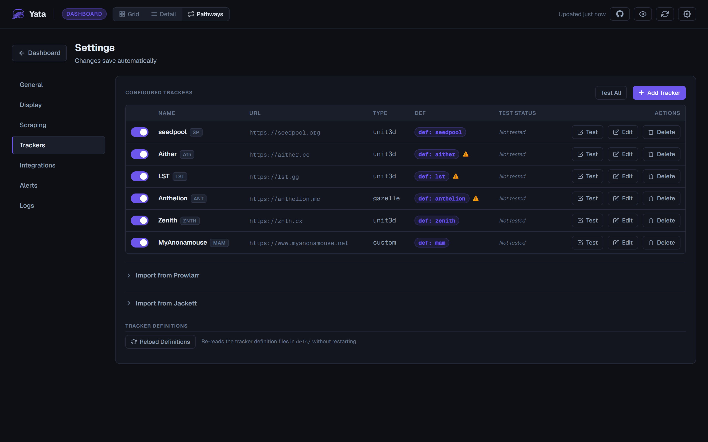

# Yata

> Self-hosted dashboard for monitoring your stats across all your private trackers — one page, one binary, your data stays yours.



Yata pulls your stats from each tracker's **API** (and, where the operator permits it, politely fills the gaps from your profile page), stores everything in a local SQLite database, and shows it all on one dashboard: unified stats, group/rank progress, promotion targets, trends, alerts, and estimated invite routes to trackers you don't have yet.

**Status: public beta.** It works, it's been running against real trackers for months, and feedback is very welcome — see [Feedback & beta notes](#feedback--beta-notes).

> **⚠️ Protect your `config.json`.** Yata stores your tracker **API keys and session cookies in plain text** in `config.json` (next to the binary, or in `./data` under Docker). Anyone who can read that file can act as you on your trackers. Never share or commit it, and take extra care on **shared boxes such as seedboxes**. See [Your data and security](#your-data-and-security) before you start, and [docs/SECURITY.md](docs/SECURITY.md) for the full picture.

---

## Why Yata

- **Private by design.** Runs entirely on your own machine/server. The only network requests it ever makes are to *your* trackers with *your* credentials, plus any integrations you explicitly configure (webhooks, qui, Prowlarr). No telemetry, no analytics, no phoning home.
- **API first, always.** API data is authoritative. Profile scraping only fills stats the API doesn't provide, and both are merged into ONE stats view per tracker (with an optional per-stat origin dot so you can see where each number came from).
- **Respect the trackers.** Scraping is rate-limited with a hard 60-minute floor that cannot be lowered. Tracker operators can request stricter limits — or forbid scraping entirely — in their definition file, and those requests always win. There's an API-only mode, and an opt-out list for sites that don't want to be supported at all.
- **Trackers are data, not code.** Every tracker is a JSON file in `defs/trackers/`. Adding or fixing a tracker never touches the app; tracker staff can own their definition.

## Feature tour

### One dashboard, every tracker

Grid or table, your choice. Cards show unified stats, styled group badges with the tracker's own rank icons, perk lists, active event banners (freeleech etc.), account age, and live progress toward your targets. Hover a stat for its recent per-day trend ("≈ 245.3 GiB per day"); the dot next to each value shows whether it came from the API or a profile scrape.



### Targets & promotions

Load targets straight from a rank's real requirements ("Load from Group"), or set your own. Progress bars, time estimates from your recent growth, and full support for either/or requirements — e.g. Anthelion's *"5 uploads and/or 10 adoptions"*:

<p align="center"></p>

Requirements and estimates are guidance for planning, not guarantees — always check the tracker's own promotion rules.

### History — see your growth

A dedicated view over the months of stats Yata records for every tracker. Pick a metric, overlay one or many trackers in their own colours, and choose a range from 48 hours to all-time. Hover for a crosshair readout, or click to pin two points for an exact delta and per-day rate. Switch between cumulative **Value** and **Rate/day**, add a **Σ Portfolio** line summing your trackers, or turn on a dashed **projection** tail. With a single tracker selected, its targets (yours or its group's) are drawn as reference lines — so you can watch your trajectory close on the goal:



### Pathways — where can I go from here?

Estimated invite routes from the trackers you have to the one you want, powered by the community [trackerpathways](https://github.com/handokota/trackerpathways) dataset (MIT). The first hop is evaluated against your live stats — including the full class-requirement breakdown — and later hops use community estimates. Tracker-specific invite rules that the community data misses (e.g. MyAnonamouse's separate invite-forum requirements) are layered in from the tracker's definition, clearly marked:



### Alerts & notifications

Webhook notifications to Discord, Telegram, Gotify, or any generic JSON endpoint — or just the in-app notification centre. Build rules from conditions (ratio below X, hit & run appears, tracker unreachable, a freeleech/event banner goes up — the banner text is passed through, unregistered torrents in qui), scope them to specific trackers, and set cooldowns. Rules are evaluated on the server every few minutes, so alerts fire even with no browser open. Webhook URLs are hidden in the UI once saved, and the alerts export strips secrets so you can share your setup safely.



### Polite scraping, transparent policy

The dashboard shows exactly why any scrape is blocked and when the next one is allowed. Limits are enforced server-side and survive restarts.



The effective interval is the **maximum** of every layer — nothing can undercut a stricter layer above it:

| Layer | Set by | Notes |
|---|---|---|
| Hard floor | the app | 60 min — cannot be lowered by anyone |
| Global setting | you (Settings → Scraping) | default 120 min (floor 60) |
| Tracker type def | software def file | rarely used |
| Tracker def | **tracker operator** | e.g. "≥ 120 min, max 6/day" |
| Per-tracker setting | you (tracker edit) | can only make it stricter |

The daily cap takes the most restrictive non-zero value, and an operator's `disable_scraping` can never be overridden. Trackers on the opt-out list (`defs/optout.json`) cannot be added at all.

### Themes & display

Thirteen built-in themes plus a live preview of every display option. Drop your own `.css` in `static/themes/` to add more — override only the variables you want.

Sizes can be shown as each tracker labels them or relabelled to GiB/TiB throughout. That is a relabel only: tracker software computes 1024-based sizes whichever label it prints, so Yata reads GB and GiB as the same unit.



Tracker rank icons use the same Font Awesome classes the tracker sites themselves use. If you own Font Awesome Pro, drop it into `static/fontawesome/` (`css/all.min.css` + `webfonts/`) and you'll see the real icons; without it, Pro-only icons automatically fall back to a free icon — nothing breaks.

### And the rest

- **Connectivity test** per tracker — one click tells you whether the API, the scrape cookie, or both are working, and why not
- **48-hour sparklines** and aggregate trend cards
- **Login protection** — optional single-user auth (bcrypt + sessions) for instances reachable beyond localhost, with optional TOTP two-factor, single-use recovery codes and brute-force lockout
- **Backups & portability** — one-click config export/import (with automatic pre-import backup), opt-in scheduled backups, tracker history CSV export
- **Rolling log viewer** — live logs in Settings for troubleshooting and bug reports; query strings never reach the log
- **Demo tracker** — explore the whole UI safely with mock data, no credentials needed



## Quick start

Pick one. Full instructions for each — services, updates, reverse proxies, hostnames, backups — are in the **[setup guide](docs/SETUP.md)**.

**Docker** — save this as `docker-compose.yml`, then `docker compose up -d` and open http://localhost:8420:

```yaml
services:
  yata:
    image: ghcr.io/yata-dash/yata-dash:main
    container_name: yata
    ports:
      - "8420:8420"
    volumes:
      - ./data:/data         # config.json + database — back up this folder
    environment:
      - TZ=Etc/UTC           # your timezone, e.g. Australia/Brisbane
    restart: unless-stopped
```

**Linux / macOS** — download the zip for your platform from the [latest release](https://github.com/Yata-Dash/Yata-Dash/releases/latest), unpack it, run `./yata` from inside that folder.

**Windows** — download `yata-<version>-windows-amd64.zip` from the [latest release](https://github.com/Yata-Dash/Yata-Dash/releases/latest), extract it, run `yata.exe`.

**From source** — Go 1.23+ and Node 18+, then `make build && ./yata` (or `.\build.ps1 -Run` on Windows).

Yata listens on port 8420 and binds all interfaces by default; `--port` and `--host 127.0.0.1` change that ([all flags](docs/SETUP.md#port-address-and-file-paths)).

## Setting up

### Your data and security

Yata keeps everything in two files, next to the binary (or in `./data` under Docker):

- **`config.json`** — your trackers, settings and **credentials**. API keys and session cookies are stored **in plain text**; anyone who can read it can act as you on every tracker you've added.
- **`yata.db`** — stats, history, and your login sessions.

Yata creates both owner-only and tightens the permissions at every start, so other accounts on the machine can't read them (root and the seedbox operator still can — on a shared box, prefer API-only trackers with no session cookie). Beyond that:

- Never commit, paste or share `config.json`. **The config export is the same file, credentials included** — it's a backup, and nobody legitimate will ever ask you for it.
- To get help, send **`yata.log`** — credentials are stripped from it. *Export alerts* is the only other export that's safe to share.

What Yata protects, what it deliberately doesn't, and how to run it safely on a LAN, a seedbox or the internet: [docs/SECURITY.md](docs/SECURITY.md).

### Add your trackers

1. Open **Settings → Trackers → Add Tracker** and pick your tracker from the list (or enter any base URL — trackers without a definition still work for all API stats).
2. Paste your **API key** (usually tracker profile → API/Security settings; the form shows a tracker-specific hint where we have one).
3. *Optional, for extra stats:* add your **username** and **session cookie** to enable profile scraping for the stats the API doesn't expose (seed size, average seed time, and friends). Log in to the tracker → DevTools (F12) → copy the cookie header. Trackers that report no join date will ask you to enter it once, for account-age tracking.
4. Hit **Test** — it tells you immediately whether the API and the scrape each work, and what's missing if not.

### If anything but this machine can reach it

Yata binds `0.0.0.0` by default so Docker, LAN and Tailscale setups just work — which means **anyone who can reach the port has full access until you set up a login** (Settings → General → Account; Yata warns while that's true). Add **two-factor** there too if it's reachable from outside your network, and put TLS on a reverse proxy in front.

Reaching Yata by a **domain or Tailscale name** (rather than an IP or `localhost`) needs the name added once — the page tells you when, and the [setup guide](docs/SETUP.md#reaching-yata-by-a-hostname) covers every way to add it, which reverse proxies need it, and what to do if you're locked out.

## Integrations

- **Read-only API** — `/api/summary` for Homepage, Homarr, Uptime Kuma or your own scripts, and `/api/history/series` for Grafana. Tokens can't change anything or see credentials. See the **[API reference](docs/API.md)**.
- **qui** — live qBittorrent seed-size bars and per-tracker problem counts (unregistered, tracker down/error) for alert rules.
- **Prowlarr / Jackett** — import your indexer list, credentials included, so trackers arrive ready to go.
- **Webhooks** — Discord, Telegram, Gotify or any JSON endpoint, for alerts and the weekly digest.

## For tracker staff

Yata is built to be a good citizen, and definitions are designed so **you** stay in control:

- Your definition file (`defs/trackers/yours.json`) carries your **rate-limit requests** (`min_interval_minutes`, `max_scrapes_per_day`) and they override every user setting — or set `disable_scraping: true` and Yata will never touch a profile page on your site.
- Prefer not to be supported at all? One entry in `defs/optout.json` blocks your tracker from being added, with a message shown to the user.
- Every definition records `last_updated` and `approved_by` (staff name/role/date) so support stays accountable and current.
- API-first means a user with an API key generates exactly the same load as any API consumer you already allow — scraping only exists to fill the gaps your API leaves, at a floor of once per hour.
- **Yata identifies its traffic** so you can monitor it: by default every request (API and scrape) carries a `Yata/<version>` User-Agent suffix — one `grep Yata access.log` tells you exactly what the app does on your site, and a one-line nginx/WAF rule can rate-limit or block it. Your def's `identify` field can switch this to an `X-Yata-Version` header (if your session security dislikes UA changes) or disable it (if your bot protection would challenge it).

Questions, corrections, or requests — please open an issue.

## Bundled tracker definitions

Any trackers not approved should only be used in API only mode until approval has been confirmed. A warning will appear in app.
If you are a tracker not on this list please reach out.
If you are a tracker on this list and wish to approve or ask to opt out entirely, please reach out. 

<!-- BEGIN GENERATED TRACKER TABLE (go run ./tools/defsdoc) -->
| Tracker | Platform | Approved | Stats | Limit | Notes |
|---|---|---|---|---|---|
| Aither | UNIT3D | Yes | 7/7 | API only |  |
| AnimeBytes | Custom API | No | 4/4 | API only | Uses the personal stats API; account age is entered manually |
| Anthelion | Gazelle (ANT/NEB) | Yes | 6/6 | API only | Expanded API stats added 2026-07, shared with Nebulance |
| Blutopia | UNIT3D | No | 3/5 | API only |  |
| BroadcastTheNet | Custom API | No | 5/6 | API only | JSON-RPC userInfo; 150 API calls per hour |
| DarkPeers | UNIT3D | Yes | 3/6 (4 scraped) | 180min |  |
| GazelleGames | GazelleGames | No | 1/1 | API only |  |
| Hawke-uno | UNIT3D | No | 6/6 | API only | Not on this tracker can't seek approval |
| HHD | UNIT3D | No | 6/6 | API only |  |
| InfinityHD | UNIT3D | Yes | 3/6 (4 scraped) | Default |  |
| LST | UNIT3D | Yes | 3/6 (4 scraped) | 180min |  |
| Luminarr | UNIT3D | Yes | 3/6 (4 scraped) | 120min |  |
| MidnightScene | UNIT3D | Yes | 3/5 (4 scraped) | 60min |  |
| MyAnonamouse | Custom API | Yes | 3/3 | API only |  |
| Nebulance | Gazelle (ANT/NEB) | No | 5/5 | API only | Ratioless; episode and season seed-time rules differ |
| OldToonsWorld | UNIT3D | Yes | 5/5 | API only | Added all required stats to API - Thanks team! |
| OnlyEncodes+ | UNIT3D | Yes | 3/6 (4 scraped) | Once per day |  |
| Orpheus | Gazelle (ajax.php) | No | 6/6 | API only | Required ratio is calculated dynamically |
| PeerGarden | traxary | No | 4/6 | API only | Comments and forum posts not yet in the API |
| Redacted | Gazelle (ajax.php) | No | 6/6 | API only |  |
| ReelFliX | UNIT3D | Yes | 6/6 | API only |  |
| RetroFlix | Custom API | Yes | 3/3 | API only | Added API stats - Thanks team! |
| RocketHD | UNIT3D | Yes | 3/6 | API only |  |
| Seedpool | UNIT3D | Yes | 2/3 (3 scraped) | 180min |  |
| SpeedApp | Custom API | Yes | 3/3 | API only | Added API stats - Thanks team! |
| Unwalled | UNIT3D | Yes | 3/5 (4 scraped) | 180min |  |
| Upload.cx | UNIT3D | No | 3/6 | API only |  |
| YUSCENE | UNIT3D | Yes | 3/5 (4 scraped) | 180min |  |
| Zenith | UNIT3D | Yes | 6/6 | API only | API reworked: extended stats and events, proposed upstream |
<!-- END GENERATED TRACKER TABLE -->

**Stats** is how much of that tracker's *own* promotion ladder Yata can follow from its API — "3/6" means three of the six stats its ranks are based on are reported, so progress toward the other three can't be shown. "(4 scraped)" is the figure with profile scraping on, where the operator permits it. A low number is the tracker's API being incomplete, not Yata failing; the app names the exact missing stats on each tracker's page.

Everything but Notes is generated from the definitions (`go run ./tools/defsdoc`), so it can't drift from what the app actually does.

Plus a credential-free demo tracker. Definitions carry the full group ladders (colours, icons, promotion requirements including either/or paths, perks) where the tracker publishes them. Adding a tracker is one JSON file — see [CONTRIBUTING.md](docs/CONTRIBUTING.md#adding-or-fixing-a-tracker).

Trackers with no API that don't welcome scraping (TorrentLeech, IPTorrents, the Z sites) aren't included, and won't be unless they add an API or ask.

## Development

`go run ./cmd/yata` for the backend, `cd web && npm run dev` for the frontend with hot reload. Layout, tests, branch flow and the rules that aren't negotiable are in **[CONTRIBUTING.md](docs/CONTRIBUTING.md)**.

## Feedback & beta notes

This is a beta: expect rough edges and report anything odd — especially stats that parse wrong, group ladders that have drifted from the def, promotion or pathway estimates that disagree with reality, and anything a tracker operator wants changed about how their site is handled. [What to include in a report](docs/CONTRIBUTING.md#reporting-a-problem).

## License

[GPL-3.0](LICENSE). Free to use, study, modify, and redistribute — forever. Any derivative must stay open source under the same terms, so no fork of Yata can ever become a paid or closed product. If you'd rather rebuild the whole idea from scratch in your own code, that's not a derivative and you owe nobody anything — go for it, we actively encourage it.


## Credits

- [trackerpathways](https://github.com/handokota/trackerpathways) — community invite-route dataset (MIT), bundled as `defs/pathways/routes.json`
- [qui](https://github.com/autobrr/qui) — qBittorrent stats integration
- Font Awesome Free — bundled icon set (Pro supported but never bundled; bring your own license)

*All data in the screenshots above is synthetic demo data.*
